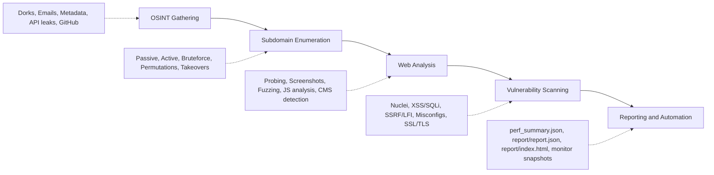
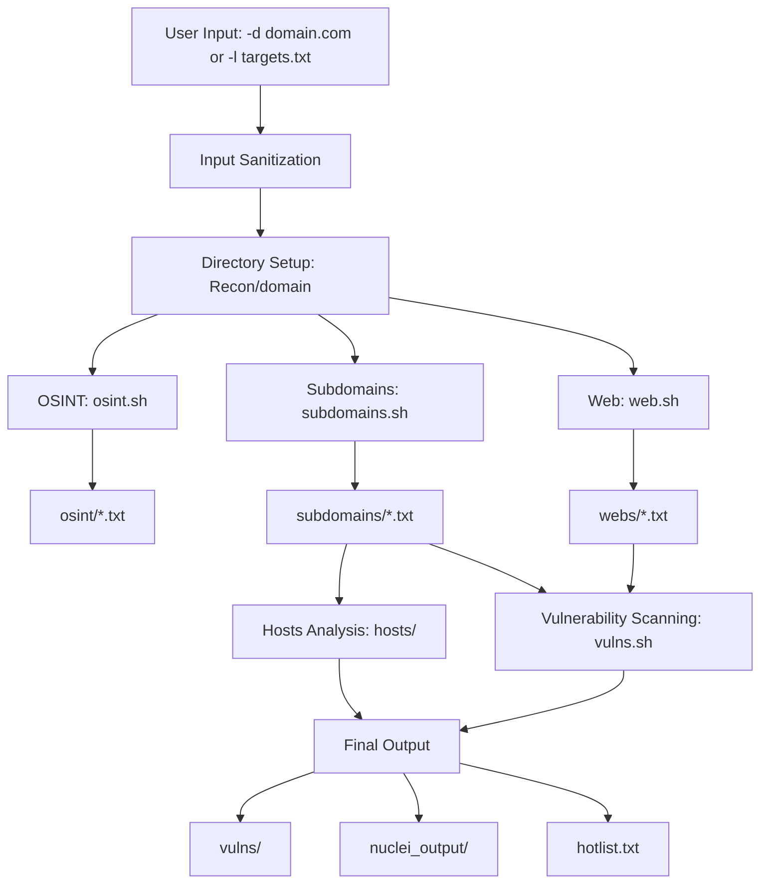

# Concepts & Architecture

This guide explains the fundamental concepts behind reconFTW, its architecture, and how it orchestrates reconnaissance workflows.

---

## What is reconFTW?

reconFTW is a **modular reconnaissance automation framework** that integrates 80+ security tools into a unified workflow. Rather than running tools individually and correlating results manually, reconFTW:

1. **Orchestrates** tools in the optimal order
2. **Manages** input/output between tools automatically
3. **Deduplicates** and normalizes results
4. **Resumes** interrupted scans from checkpoints
5. **Scales** across distributed infrastructure (via Axiom)

### Philosophy

reconFTW follows these design principles:

- **Thorough over fast**: Cover all attack surface, don't miss findings
- **Modular**: Enable/disable any component without breaking others
- **Resumable**: Never lose progress on long-running scans
- **Configurable**: Every behavior can be customized
- **Fail-soft**: Continue scanning even if individual tools fail

---

## Reconnaissance Methodology

reconFTW implements a structured reconnaissance methodology following industry best practices:



### Phase 1: OSINT (Open Source Intelligence)

Gather publicly available information about the target:

| Technique | Purpose | Tools |
|-----------|---------|-------|
| Google Dorks | Find exposed files/pages | dorks_hunter |
| GitHub Dorks | Find leaked credentials | gitdorks_go |
| Metadata | Extract document metadata | metagoofil, exiftool |
| Email Harvesting | Discover email addresses | EmailHarvester, LeakSearch |
| API Leaks | Find exposed APIs | porch-pirate, SwaggerSpy, postleaksNg |
| Domain Info | WHOIS, registrant data | whois, msftrecon |

### Phase 2: Subdomain Enumeration

Discover all subdomains associated with the target:

| Technique | Type | Description |
|-----------|------|-------------|
| Passive | Non-intrusive | Query APIs, CT logs, archives |
| Active/Bruteforce | Intrusive | DNS queries with wordlists |
| Permutations | Intrusive | Generate variations |
| Recursive | Both | Enumerate subdomains of subdomains |
| Scraping | Semi-passive | Extract from web pages |

### Phase 3: Web Analysis

Analyze discovered web assets:

- HTTP probing (find live servers)
- Screenshot capture
- URL extraction (passive + crawling)
- JavaScript analysis (secrets, endpoints)
- Directory fuzzing
- CMS detection
- Parameter discovery

### Phase 4: Vulnerability Scanning

Test for security issues:

- CVE scanning with Nuclei
- Injection testing (XSS, SQLi, SSTI, LFI)
- Server-side vulnerabilities (SSRF, command injection)
- Misconfigurations (CORS, open redirect)
- SSL/TLS issues
- Subdomain takeovers

---

## Architecture Overview

reconFTW uses a modular architecture where components are separated by responsibility:

```
reconftw/
├── reconftw.sh          # Main entry point (orchestration)
├── reconftw.cfg         # Configuration file
├── secrets.cfg          # API keys (gitignored)
│
├── modules/             # Feature modules (what to do)
│   ├── utils.sh         # Utility functions
│   ├── core.sh          # Framework core (logging, lifecycle)
│   ├── osint.sh         # OSINT functions
│   ├── subdomains.sh    # Subdomain enumeration
│   ├── web.sh           # Web analysis
│   ├── vulns.sh         # Vulnerability scanning
│   ├── axiom.sh         # Distributed scanning
│   └── modes.sh         # Scan mode orchestration
│
├── lib/                 # Pure libraries (how to do it)
│   ├── common.sh        # Shared utility functions (dedupe, ensure_dirs)
│   ├── config.sh        # Configuration helpers
│   ├── parallel.sh      # Parallelization framework
│   └── validation.sh    # Input validation
│
└── Recon/               # Output directory
    └── <domain>/        # Per-target results
```

### Module Loading Order

Modules are loaded in a specific order to ensure dependencies are satisfied:

```bash
1. lib/validation.sh     # Input validation (first)
2. lib/common.sh         # Shared utilities (ensure_dirs, dedupe, etc.)
3. lib/parallel.sh       # Parallelization framework
4. modules/utils.sh      # Base utilities
5. modules/core.sh       # Framework infrastructure
6. modules/osint.sh      # OSINT functions
7. modules/subdomains.sh # Subdomain functions
8. modules/web.sh        # Web analysis functions
9. modules/vulns.sh      # Vulnerability functions
10. modules/axiom.sh     # Distributed scanning
11. modules/modes.sh     # Mode orchestration (last)
```

### Key Functions

#### Lifecycle Functions (core.sh)

```bash
start_func(name, description)  # Begin a function, check if already done
end_func(message, name)        # Complete a function, mark as done
```

Every scan function follows this pattern:

```bash
function some_scan() {
    if [[ ! -f "$called_fn_dir/.${FUNCNAME[0]}" ]] || [[ $DIFF == true ]]; then
        start_func "${FUNCNAME[0]}" "Running some scan..."
        
        # ... actual scan logic ...
        
        end_func "Results saved in..." "${FUNCNAME[0]}"
    fi
}
```

#### Utility Functions (utils.sh)

| Function | Purpose |
|----------|---------|
| `sanitize_domain()` | Clean and validate domain input |
| `sanitize_ip()` | Clean and validate IP/CIDR input |
| `deleteOutScoped()` | Remove out-of-scope entries |
| `run_command()` | Execute with logging (respects DRY_RUN) |
| `should_run_deep()` | Check if DEEP mode should activate |
| `retry_with_backoff()` | Retry failed operations |
| `check_disk_space()` | Verify available storage |

#### Common Library Functions (lib/common.sh)

| Function | Purpose |
|----------|---------|
| `ensure_dirs()` | Create multiple directories safely |
| `safe_backup()` | Backup file with timestamp |
| `skip_notification()` | Log skipped function notification |
| `count_lines()` | Count lines in file safely |
| `safe_count()` | Count with fallback to 0 |
| `dedupe_append()` | Append and deduplicate file |
| `run_tool()` | Execute tool with timeout and error handling |
| `process_results()` | Process and dedupe results |
| `should_run_function()` | Check if function should run (checkpoint aware) |

#### Parallelization Functions (lib/parallel.sh)

| Function | Purpose |
|----------|---------|
| `parallel_run()` | Run commands in parallel with job limit |
| `parallel_funcs()` | Run bash functions in parallel |
| `parallel_batch()` | Run functions in grouped batches |
| `_parallel_snapshot()` | Update batch live progress (`X/Y`, `%`, elapsed, stable ETA) |
| `_parallel_emit_job_output()` | Normalize per-job status and log replay policy |
| `parallel_passive_enum()` | Parallel passive subdomain enumeration |
| `parallel_active_enum()` | Parallel active DNS enumeration |
| `parallel_postactive_enum()` | Parallel post-resolution (TLS, analytics) |
| `parallel_brute_enum()` | Parallel brute force (resource limited) |
| `parallel_web_vulns()` | Parallel web vulnerability scanning |
| `parallel_subdomains_full()` | Orchestrate full parallelized subdomain enum |

---

## Data Flow

Understanding how data flows through reconFTW helps interpret results:



### Data Dependencies

| Module | Depends On | Produces |
|--------|------------|----------|
| OSINT | Target domain | osint/*.txt |
| Subdomains | Target domain | subdomains/subdomains.txt |
| Hosts | subdomains.txt | hosts/ips.txt, hosts/portscan* |
| Web Probing | subdomains.txt | webs/webs.txt |
| URL Collection | webs.txt | webs/url_extract.txt |
| JS Analysis | webs.txt | js/js_secrets.txt |
| Vulns | webs.txt, urls | vulns/*, nuclei_output/* |

---

## Scan Phases

When you run `./reconftw.sh -d target.com -r`, the following phases execute:

### 1. Initialization (`start()`)

```
[start] → Validate config → Check disk space → Create directories → Initialize logging
```

### 2. OSINT Phase

```
[osint] → domain_info → emails → google_dorks → github_repos → metadata → apileaks
```

### 3. Subdomain Phase

```
[subdomains] → sub_passive → sub_crt → sub_brute → sub_permut → sub_scraping → sub_dns
```

### 4. Host Analysis

```
[hosts] → portscan → service_fingerprint → cdnprovider → waf_checks → geo_info
```

### 5. Web Analysis

```
[web] → webprobe → screenshot → urlchecks → jschecks → fuzz → cms_scanner
```

### 6. Vulnerability Phase (if `-a` flag)

```
[vulns] → nuclei → xss → sqli → ssrf → lfi → ssti → ...
```

### 7. Finalization (`end()`)

```
[end] → Build hotlist → Generate reports → Send notifications → Cleanup
```

---

## Checkpoint System

reconFTW uses a checkpoint system to track completed functions and enable scan resumption.

### How It Works

Each function creates a marker file when completed:

```
Recon/<domain>/.called_fn/
├── .sub_passive          # sub_passive() completed
├── .sub_brute            # sub_brute() completed
├── .webprobe_simple      # webprobe_simple() completed
└── ...
```

### Resume Behavior

When you re-run a scan:

1. reconFTW checks for existing `.called_fn` markers
2. Functions with markers are **skipped**
3. Functions without markers are **executed**

```bash
# First run - executes all functions
./reconftw.sh -d target.com -r

# Second run - skips completed functions
./reconftw.sh -d target.com -r
# Output: "sub_passive has already been processed..."
```

### Force Re-execution

To re-run a specific function:

```bash
# Delete the marker
rm Recon/target.com/.called_fn/.sub_passive

# Or delete all markers (full rescan)
rm -rf Recon/target.com/.called_fn/
```

### DIFF Mode

The `-r` flag with `DIFF=true` in config enables differential scanning:

```bash
# Config setting
DIFF=true
```

In DIFF mode:
- All functions execute regardless of markers
- Only **new** findings are highlighted
- Previous results are preserved

---

## Understanding DEEP Mode

DEEP mode enables thorough scanning for high-value targets:

### Standard vs DEEP

| Aspect | Standard | DEEP |
|--------|----------|------|
| Wordlists | Small (~10k) | Large (~100k+) |
| Permutations | Basic | Extensive |
| Recursive depth | Limited | Full |
| Fuzzing | Common paths | Extended |
| Time | 1-4 hours | 4-24+ hours |

### Activation

```bash
# Command line
./reconftw.sh -d target.com -r --deep

# Or in config
DEEP=true
```

### Auto-DEEP

reconFTW can auto-enable DEEP based on result counts:

```bash
# In reconftw.cfg
DEEP_LIMIT=500     # First threshold
DEEP_LIMIT2=1500   # Second threshold
```

If subdomains < DEEP_LIMIT, additional enumeration runs automatically.

---

## Error Handling

reconFTW uses a "fail-soft" approach:

### Error Codes

| Code | Meaning |
|------|---------|
| 0 | Success |
| 1 | General error |
| 2 | Missing dependency |
| 3 | Invalid input |
| 4 | Network error |
| 5 | Disk space error |
| 6 | Permission error |
| 7 | Timeout |
| 8 | Configuration error |

### Error Trapping

Errors are logged but don't stop the scan:

```bash
# From reconftw.sh
trap 'rc=$?; ... echo "$msg" >>"$LOGFILE" ...' ERR
```

### Circuit Breaker

For unreliable tools, reconFTW implements a circuit breaker:

```bash
# After 3 consecutive failures, tool is skipped
CIRCUIT_BREAKER_THRESHOLD=3
CIRCUIT_BREAKER_TIMEOUT=300  # Reset after 5 minutes
```

---

## Global Variables

Key variables used throughout reconFTW:

### Required Variables

| Variable | Description |
|----------|-------------|
| `$SCRIPTPATH` | Path to reconFTW installation |
| `$domain` | Current target domain |
| `$dir` | Output directory for current scan |
| `$called_fn_dir` | Directory for checkpoint markers |
| `$LOGFILE` | Current log file path |

### Configuration Flags

| Variable | Default | Description |
|----------|---------|-------------|
| `$DEEP` | false | Enable thorough scanning |
| `$DIFF` | false | Differential mode |
| `$AXIOM` | false | Distributed scanning |
| `$DRY_RUN` | false | Preview without executing |

---

## Visual: Architecture Diagram

```
                                    ┌─────────────────────────────────────┐
                                    │           CONFIGURATION              │
                                    │  reconftw.cfg  │  secrets.cfg        │
                                    │  ─────────────────────────────────   │
                                    │  • API keys    • Module toggles      │
                                    │  • Wordlists   • Rate limits         │
                                    └───────────────────┬─────────────────┘
                                                        │
                                                        ▼
┌────────────────────┐         ┌─────────────────────────────────────────────────────┐
│      INPUT         │         │                  reconftw.sh                        │
│  ────────────────  │────────▶│              (Main Orchestrator)                    │
│  -d domain.com     │         │  ───────────────────────────────────────────────    │
│  -l targets.txt    │         │  • Argument parsing    • Module loading             │
│  -m multi.txt      │         │  • Checkpoint system   • Notification hooks         │
└────────────────────┘         └────────────────────────┬────────────────────────────┘
                                                        │
                     ┌──────────────────────────────────┼──────────────────────────────────┐
                     │                                  │                                  │
                     ▼                                  ▼                                  ▼
        ┌────────────────────┐            ┌────────────────────┐            ┌────────────────────┐
        │     lib/           │            │     modules/       │            │     config/        │
        │  ────────────────  │            │  ────────────────  │            │  ────────────────  │
        │  common.sh         │            │  osint.sh          │            │  amass_config.ini  │
        │  parallel.sh       │            │  subdomains.sh     │            │  nuclei_config.yml │
        │  validation.sh     │            │  web.sh            │            │  sensitive_domains │
        │                    │            │  vulns.sh          │            │  ...               │
        │  Utilities for:    │            │  core.sh           │            │                    │
        │  • Parallelization │            │  modes.sh          │            │  Tool configs      │
        │  • Error handling  │            │  axiom.sh          │            │  Wordlists paths   │
        │  • File operations │            │  utils.sh          │            │                    │
        └────────────────────┘            └─────────┬──────────┘            └────────────────────┘
                                                    │
                     ┌──────────────────────────────┴──────────────────────────────┐
                     │                       SCAN PHASES                           │
                     │  ──────────────────────────────────────────────────────────  │
                     │                                                             │
                     │  ┌─────────┐   ┌─────────┐   ┌─────────┐   ┌─────────┐     │
                     │  │ 1.OSINT │──▶│ 2.SUBS  │──▶│ 3.WEB   │──▶│ 4.VULNS │     │
                     │  │(passive)│   │(active) │   │(probe)  │   │(exploit)│     │
                     │  └─────────┘   └─────────┘   └─────────┘   └─────────┘     │
                     │                                                             │
                     │  Data flows from each phase to the next                     │
                     └──────────────────────────────┬──────────────────────────────┘
                                                    │
                                                    ▼
                              ┌─────────────────────────────────────────────────┐
                              │               OUTPUT STRUCTURE                   │
                              │  Recon/<domain>/                                │
                              │  ─────────────────────────────────────────────  │
                              │  ├── subdomains/    (discovered subs)          │
                              │  ├── webs/          (live web URLs)            │
                              │  ├── hosts/         (IP data, ports)           │
                              │  ├── vulns/         (vulnerability results)    │
                              │  ├── osint/         (passive intel)            │
                              │  ├── screenshots/   (web captures)             │
                              │  ├── .called_fn/    (checkpoint markers)       │
                              │  └── .log/          (execution logs)           │
                              └─────────────────────────────────────────────────┘
                                                    │
                     ┌──────────────────────────────┴──────────────────────────────┐
                     │                     OPTIONAL: AXIOM                         │
                     ▼                                                             │
        ┌────────────────────────────────────────────────────────────────┐        │
        │                    Distributed Execution                        │        │
        │  ────────────────────────────────────────────────────────────  │        │
        │  ┌────────┐  ┌────────┐  ┌────────┐  ┌────────┐  ┌────────┐   │        │
        │  │ node01 │  │ node02 │  │ node03 │  │ node04 │  │ node05 │   │◀───────┘
        │  └────────┘  └────────┘  └────────┘  └────────┘  └────────┘   │
        │                                                                │
        │  Splits workload across cloud instances for faster scanning    │
        └────────────────────────────────────────────────────────────────┘
```

### Module Interaction Flow

```
┌─────────────────────────────────────────────────────────────────────────────┐
│                           DETAILED DATA FLOW                                 │
├─────────────────────────────────────────────────────────────────────────────┤
│                                                                              │
│  INPUT: domain.com                                                          │
│         │                                                                    │
│         ▼                                                                    │
│  ┌──────────────┐                                                           │
│  │    OSINT     │──▶ osint/emails.txt, osint/dorks.txt                      │
│  │  (passive)   │    osint/github_secrets.json                              │
│  └──────┬───────┘                                                           │
│         │                                                                    │
│         ▼                                                                    │
│  ┌──────────────┐    Passive: subfinder, crt.sh                              │
│  │  SUBDOMAINS  │──▶ Active:  puredns (massdns backend) or dnsx             │
│  │  (enum)      │    Output:  subdomains/subdomains.txt                     │
│  └──────┬───────┘                                                           │
│         │                                                                    │
│         ▼                                                                    │
│  ┌──────────────┐                                                           │
│  │  WEB PROBE   │──▶ webs/webs.txt (live HTTP/HTTPS URLs)                   │
│  │  (httpx)     │    webs/web_full_info_plain.txt (titles, status, tech)    │
│  └──────┬───────┘                                                           │
│         │                                                                    │
│         ├───────────────────────┬───────────────────────┐                   │
│         ▼                       ▼                       ▼                   │
│  ┌──────────────┐       ┌──────────────┐       ┌──────────────┐            │
│  │  URL CHECK   │       │  JS CHECKS   │       │  SCREENSHOTS │            │
│  │  (katana)    │       │  (xnlink)    │       │  (nuclei)    │            │
│  └──────┬───────┘       └──────┬───────┘       └──────────────┘            │
│         │                       │                                           │
│         ▼                       ▼                                           │
│  ┌──────────────┐       ┌──────────────┐                                    │
│  │  gf patterns │       │  JS secrets  │                                    │
│  │  (params)    │       │  (API keys)  │                                    │
│  └──────┬───────┘       └──────────────┘                                    │
│         │                                                                    │
│         ▼                                                                    │
│  ┌──────────────────────────────────────────────────────────────────┐       │
│  │                        VULNERABILITY SCANNING                     │       │
│  │  ─────────────────────────────────────────────────────────────   │       │
│  │  nuclei (CVEs)  │  dalfox (XSS)  │  sqlmap (SQLi)  │  TInjA      │       │
│  │  ssrf           │  lfi           │  smugglex       │  toxicache  │       │
│  └──────────────────────────────────────────────────────────────────┘       │
│         │                                                                    │
│         ▼                                                                    │
│  nuclei_output/, vulns/xss.txt, vulns/sqli.txt, etc.                        │
│                                                                              │
└─────────────────────────────────────────────────────────────────────────────┘
```

---

## OPSEC and Legal

### Authorization Requirements

**NEVER scan without explicit written authorization.** This includes:

1. **Bug Bounty Programs**: Read rules carefully, some exclude certain asset types
2. **Penetration Tests**: Written statement of work (SOW) with defined scope
3. **Internal Testing**: Formal approval from asset owners
4. **Personal Projects**: Only test assets you own

### Pre-Scan Checklist

```markdown
## Authorization Checklist

- [ ] Written permission obtained (email, contract, bug bounty policy)
- [ ] Scope document reviewed
  - [ ] In-scope targets identified
  - [ ] Out-of-scope targets documented
- [ ] Rate limits defined (if any)
- [ ] Testing window confirmed
- [ ] Emergency contact identified
- [ ] Data handling requirements understood
- [ ] NDA signed (if required)
```

### OPSEC Best Practices

| Consideration | Recommendation |
|---------------|----------------|
| **IP Attribution** | Use VPS or cloud instances, not personal IP |
| **Rate Limiting** | Start conservative, increase gradually |
| **Noise Reduction** | Begin with passive mode (`-p`) |
| **Data Security** | Encrypt sensitive findings, secure `secrets.cfg` |
| **Logging** | Keep records of authorization and scan times |
| **Communication** | Notify target of critical findings immediately |

### Reducing Detection Risk

```bash
# Start with passive reconnaissance (no direct contact)
./reconftw.sh -d target.com -p

# Use adaptive rate limiting
./reconftw.sh -d target.com -r --adaptive-rate

# Lower rate limits in config
# In reconftw.cfg
HTTPX_RATELIMIT=50
NUCLEI_RATELIMIT=50
```

### Legal Risks by Region

| Region | Key Laws | Notes |
|--------|----------|-------|
| **USA** | CFAA | Unauthorized access is federal crime |
| **EU** | Computer Misuse Acts (varies) | Strict consent requirements |
| **UK** | Computer Misuse Act 1990 | Even attempting unauthorized access is illegal |
| **Global** | Various | Always research local laws |

### What to Do If Something Goes Wrong

1. **Stop scanning immediately**
2. **Document what happened** (timestamps, commands run)
3. **Contact the target** via emergency channels
4. **Preserve evidence** of authorization
5. **Consult legal counsel** if needed

---

## Recommended Workflows

### Bug Bounty - Standard Recon

Best for: Regular bug bounty hunting on established programs.

```bash
# Week 1: Initial passive recon
./reconftw.sh -d target.com -p

# Week 1: Full reconnaissance (if passive looks good)
./reconftw.sh -d target.com -r

# Week 2+: Incremental updates
./reconftw.sh -d target.com -r --incremental
```

### Bug Bounty - New Program

Best for: New programs where you want full coverage quickly.

```bash
# Full scan with vulnerabilities
./reconftw.sh -d target.com -a

# Enable notifications
# In reconftw.cfg: NOTIFICATION=true

# Check results
ls -la Recon/target.com/vulns/
```

### Large Scope / Multiple Targets

Best for: Programs with many root domains or large scope.

```bash
# Create scope file
cat > scope.txt << EOF
target1.com
target2.com
*.target3.com
EOF

# Use Axiom for distributed scanning
./reconftw.sh -l scope.txt -r -v

# Or run sequentially with multi-mode
./reconftw.sh -m client-project -l scope.txt -r
```

### Red Team / Pentest

Best for: Authorized penetration tests with defined scope.

```bash
# Start passive (intelligence gathering)
./reconftw.sh -d target.com -n  # OSINT only

# Then subdomains
./reconftw.sh -d target.com -s

# Finally, careful active scanning
./reconftw.sh -d target.com -a -q 50  # Rate limited
```

### Automated Weekly Monitoring

Best for: Continuous monitoring of assets.

```bash
# Cron job (every Sunday at 2 AM)
0 2 * * 0 cd /path/to/reconftw && ./reconftw.sh -d target.com -r --incremental -z

# Or use Docker
0 2 * * 0 docker run -v /data/recon:/reconftw/Recon six2dez/reconftw -d target.com -r --incremental
```

### Quick Assessment

Best for: Rapid initial assessment before deeper testing.

```bash
# Passive only (fastest, safest)
./reconftw.sh -d target.com -p

# Time: ~15-30 minutes
# Output: subdomains, basic OSINT, no active scanning
```

### CI/CD Integration

Best for: Automated security checks in pipelines.

```yaml
# GitHub Actions example
- name: Security Recon
  run: |
    ./reconftw.sh -d ${{ secrets.TARGET }} -p -z
    
- name: Check Critical Vulns
  run: |
    if [ -s Recon/*/nuclei_output/critical_json.txt ]; then
      echo "Critical vulnerabilities found!"
      exit 1
    fi
```

---

## Next Steps

Now that you understand how reconFTW works:

1. **[Learn the command line options](../03-usage/usage.md)** - Master all flags
2. **[Configure your setup](../04-configuration/configuration.md)** - Customize behavior
3. **[Explore modules in depth](../05-modules/)** - Understand each capability
