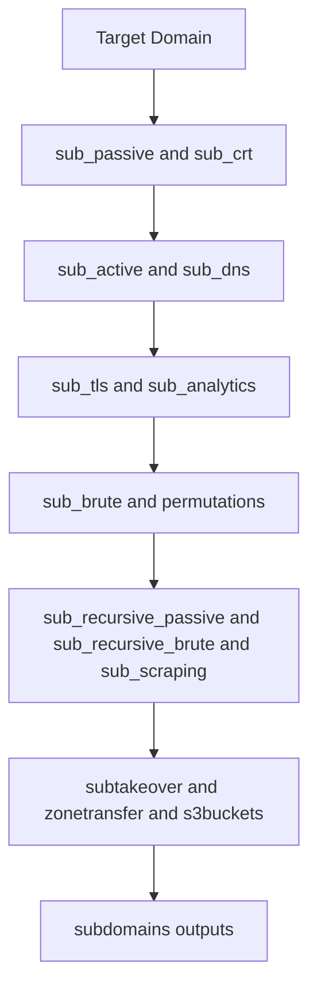

# Subdomain Enumeration Module

The subdomain enumeration module is the cornerstone of reconFTW, discovering all subdomains associated with a target using multiple complementary techniques.

---

## Module Overview

| Function | Type | Purpose | Tools |
|----------|------|---------|-------|
| `sub_passive` | Passive | API-based subdomain discovery | subfinder, github-subdomains |
| `sub_crt` | Passive | Certificate transparency logs | crt.sh |
| `sub_noerror` | Active | DNS NOERROR response analysis | dnsx |
| `sub_brute` | Active | DNS bruteforce with wordlists | puredns, dnsx |
| `sub_permut` | Active | Permutation generation | gotator |
| `sub_ia_permut` | Active | AI-powered permutations | subwiz |
| `sub_regex_permut` | Active | Regex-based permutations | regulator |
| `sub_recursive_passive` | Passive | Recursive passive enum | subfinder |
| `sub_recursive_brute` | Active | Recursive bruteforce | puredns, dnsx |
| `sub_scraping` | Semi-active | Subdomain extraction from passive URLs and live web data | urlfinder, waymore, httpx, csprecon |
| `sub_analytics` | Passive | Google Analytics correlation | AnalyticsRelationships |
| `sub_tls` | Active | TLS certificate discovery | tlsx |
| `sub_dns` | Active | DNS record resolution | dnsx |
| `subtakeover` | Active | Subdomain takeover detection | nuclei, dnstake |
| `zonetransfer` | Active | DNS zone transfer check | dig |
| `s3buckets` | Active | S3 bucket enumeration | S3Scanner, CloudHunter |

## Module Flow



---

## Configuration Options

```bash
# In reconftw.cfg

# Master toggle
SUBDOMAINS_GENERAL=true

# Passive techniques
SUBPASSIVE=true              # API-based enumeration
SUBCRT=true                  # Certificate transparency
CTR_LIMIT=999999             # Max CT log results
DNS_TIME_FENCE_DAYS=0        # Filter CT to last N days (0=disabled)
SUBANALYTICS=true            # Google Analytics

# Active techniques
SUBNOERROR=false             # DNS NOERROR (can be slow)
SUBBRUTE=true                # DNS bruteforcing
SUBSCRAPING=true             # Web scraping
SUBPERMUTE=true              # Permutations
SUBIAPERMUTE=true            # AI permutations
SUBREGEXPERMUTE=true         # Regex permutations

# Recursive
SUB_RECURSIVE_PASSIVE=false  # Uses many API queries
DEEP_RECURSIVE_PASSIVE=10    # Top N for recursion
SUB_RECURSIVE_BRUTE=false    # Very resource intensive

# Filtering
DEEP_WILDCARD_FILTER=false   # Multi-level wildcard detection
EXCLUDE_SENSITIVE=false      # Skip gov/mil/edu domains

# Other
SUBTAKEOVER=true             # Takeover detection
ZONETRANSFER=true            # Zone transfer
S3BUCKETS=true               # S3 enumeration
REVERSE_IP=false             # Enable for IP targets
INSCOPE=false                # Scope filtering

	# Permutation options
	PERMUTATIONS_ENGINE=gotator
	PERMUTATIONS_WORDLIST_MODE=auto      # auto|full|short
	PERMUTATIONS_SHORT_THRESHOLD=100
	GOTATOR_FLAGS=" -depth 1 -numbers 3 -mindup -adv -md"

	# DNS resolver selection for brute/permut resolve steps
	DNS_RESOLVER=auto                    # auto|puredns|dnsx
	DNSX_THREADS=25
	DNSX_RATE_LIMIT=100
```

---

## Highlights

### Time Fencing (`DNS_TIME_FENCE_DAYS`)

Filters Certificate Transparency results to recent certificates only.

```bash
DNS_TIME_FENCE_DAYS=90  # Only certs from last 90 days
```

**Problem solved:** CT logs contain years of historical data including certificates for decommissioned infrastructure. This creates noise in results.

**Impact:** Typically reduces false positives by 20-40% on established targets.

### Deep Wildcard Detection (`DEEP_WILDCARD_FILTER`)

Detects wildcard DNS records at all subdomain levels, not just the root domain.

```bash
DEEP_WILDCARD_FILTER=true
```

**Problem solved:** Standard wildcard detection only checks `*.example.com`. Enterprise environments often have nested wildcards like `*.na45.salesforce.com` or `*.api.prod.example.com`.

**How it works:**
1. Extract unique parent domains from discovered subdomains
2. For each parent, generate a random probe: `randomstring.parent.example.com`
3. If the random probe resolves, that parent has a wildcard record
4. Remove all subdomains under wildcard parents
5. Repeat up to 5 iterations to catch multiple levels

**Output:** Detected wildcards are saved to `subdomains/wildcards_detected.txt`

**Impact:** Removes 50-80% false positives on enterprise targets with wildcard DNS.

### Sensitive Domain Exclusion (`EXCLUDE_SENSITIVE`)

Prevents scanning government, military, educational, and financial domains.

```bash
EXCLUDE_SENSITIVE=true
```

**Patterns file:** `config/sensitive_domains.txt`

**Excluded by default:**
- Government: `*.gov`, `*.gob.*`, `*.gouv.*`, `*.govt.*`
- Military: `*.mil`, `*.defense.*`, `*.army.*`
- Educational: `*.edu`, `*.ac.*`, `*.university.*`
- Financial: `*.bank`, `*.banking.*`
- Critical: `*.nhs.*`, `*.hospital.*`, `*.police.*`

**Use case:** When scanning wildcard scopes (e.g., `*.company.com`), this prevents accidental enumeration of acquired government or educational assets.

---

## Passive Enumeration

### `sub_passive` - API-Based Discovery

The primary passive enumeration function querying multiple data sources.

**Sources Queried:**
- Subfinder (50+ sources including):
  - VirusTotal
  - SecurityTrails
  - Shodan
  - Censys
  - AlienVault
  - Chaos
  - And many more...
- GitHub subdomains

**How It Works:**

```
Target domain → subfinder (API queries) → github-subdomains →
→ Deduplicate → subdomains_passive.txt
```

**Output:**
```
subdomains/subdomains_passive.txt
```

**Configuration:**
```bash
SUBPASSIVE=true
SUBFINDER_ENUM_TIMEOUT=180  # Timeout in minutes
```

> **Tip:** Configure API keys in `~/.config/subfinder/provider-config.yaml` for better results.

---

### `sub_crt` - Certificate Transparency

Queries certificate transparency logs for issued certificates.

**How It Works:**

```
Target domain → crt.sh API → Parse certificates → 
→ Extract subdomains → subdomains_crt.txt
```

**Output:**
```
subdomains/subdomains_crt.txt
```

**Sample Findings:**
```
www.example.com
api.example.com
mail.example.com
staging.example.com
*.dev.example.com  # Wildcard certificates
```

**Configuration:**
```bash
SUBCRT=true
CTR_LIMIT=999999  # Max results to fetch
```

---

### `sub_analytics` - Google Analytics Correlation

Discovers related domains through shared Google Analytics IDs.

**How It Works:**

```
Target domain → Extract GA ID from website → 
→ Find other domains with same GA ID → Output
```

**Output:**
```
subdomains/subdomains_analytics.txt
```

**Why It Works:**
Organizations often use the same Google Analytics ID across multiple properties, revealing:
- Related domains
- Acquired companies
- Partner sites
- Development environments

**Configuration:**
```bash
SUBANALYTICS=true
```

---

## Active Enumeration

### `sub_brute` - DNS Bruteforcing

Performs DNS bruteforce using wordlists to discover subdomains.

**How It Works:**

```
Wordlist → Generate DNS queries → DNS resolver (puredns or dnsx) →
→ Filter wildcards / validate responses → subdomains_brute.txt
```

**Wordlists Used:**
- Standard: `$subs_wordlist` (built-in list under `data/wordlists/`)
- Deep mode: `$subs_wordlist_big` (optional larger list; downloaded by installer)

**Output:**
```
subdomains/subdomains_brute.txt
```

**Configuration:**
```bash
SUBBRUTE=true
subs_wordlist=${WORDLISTS_DIR}/subdomains.txt
subs_wordlist_big=${tools}/subdomains_n0kovo_big.txt

# DNS resolver selection
DNS_RESOLVER=auto           # auto|puredns|dnsx
DNSX_THREADS=25
DNSX_RATE_LIMIT=100

# PureDNS settings
PUREDNS_PUBLIC_LIMIT=0        # 0 = unlimited
PUREDNS_TRUSTED_LIMIT=400
PUREDNS_WILDCARDTEST_LIMIT=30
```

> **Performance:** Bruteforcing can generate significant DNS traffic. Adjust rate limits for your environment.

---

### `sub_noerror` - DNS NOERROR Analysis

Discovers subdomains by analyzing DNS NOERROR responses (domain exists but no record type).

**How It Works:**

```
Known subdomains → Query non-existent record types →
→ NOERROR response = subdomain exists → 
→ Bruteforce variations → New subdomains
```

**Why It Works:**
Some DNS servers return NOERROR for existing domains even without specific records, revealing domains that standard bruteforce might miss.

**Output:**
```
subdomains/subdomains_noerror.txt
```

**Configuration:**
```bash
SUBNOERROR=false  # Disabled by default (can be slow)
```

---

### `sub_scraping` - URL-Based Subdomain Discovery

Extracts subdomains from passive URL datasets and live web metadata.

**How It Works:**

```
Target domain → urlfinder + waymore (passive URLs) →
Known web servers → httpx + csprecon →
Extract domains from collected URLs → Resolve and validate → Output
```

**What It Finds:**
- Historical URLs from passive sources
- Subdomains referenced in discovered URLs
- CSP-hosted domains discovered from live endpoints

**Output:**
```
subdomains/subdomains_scraping.txt
```

**Configuration:**
```bash
SUBSCRAPING=true
WAYMORE_TIMEOUT=30m
WAYMORE_LIMIT=5000
```

---

### `sub_tls` - TLS Certificate Discovery

Discovers subdomains by connecting to TLS ports and extracting certificate information.

**How It Works:**

```
IP addresses → Connect to TLS ports → 
→ Extract certificate CN/SAN → Filter in-scope → Output
```

**Ports Checked:**
```bash
# Loaded from config/tls_ports.txt
TLS_PORTS=$(cat "${SCRIPTPATH}/config/tls_ports.txt" 2>/dev/null | tr -d '\n')
```

**Output:**
```
subdomains/subdomains_tls.txt
```

**Configuration:**
```bash
TLSX_THREADS=1000
```

---

## Permutation Techniques

### `sub_permut` - Standard Permutations

Generates subdomain variations from discovered subdomains.

**Permutation Types:**
- Prefix: `dev-api`, `staging-api`, `api-v2`
- Suffix: `api-dev`, `api-staging`, `api-2`
- Word insertion: `api-internal`, `api-test`
- Number variations: `api1`, `api2`, `api3`

**Tool:**
- **gotator**: permutation generation using built-in permutation wordlists.

**How It Works:**

```
Known subdomains → gotator → Generate permutations →
→ DNS resolver (puredns or dnsx) → Filter valid → Output
```

**Output:**
```
subdomains/subdomains_permut.txt
```

**Configuration:**
```bash
SUBPERMUTE=true
PERMUTATIONS_ENGINE=gotator
PERMUTATIONS_WORDLIST_MODE=auto      # auto|full|short
PERMUTATIONS_SHORT_THRESHOLD=100
GOTATOR_FLAGS=" -depth 1 -numbers 3 -mindup -adv -md"
PERMUTATIONS_LIMIT=21474836480  # Max file size (20GB)

# DNS resolver selection for permutation resolution
DNS_RESOLVER=auto                    # auto|puredns|dnsx
DNSX_THREADS=25
DNSX_RATE_LIMIT=100
```

---

### `sub_ia_permut` - AI-Powered Permutations

Uses machine learning to generate intelligent permutations based on patterns.

**How It Works:**

```
Known subdomains → subwiz (AI model) → 
→ Learn patterns → Generate smart variations → Resolve → Output
```

**Output:**
```
subdomains/subdomains_ai_permut.txt
```

**Configuration:**
```bash
SUBIAPERMUTE=true
```

---

### `sub_regex_permut` - Regex-Based Permutations

Analyzes subdomain patterns and generates variations using regex.

**How It Works:**

```
Known subdomains → regulator (pattern analysis) →
→ Generate regex-based variations → Resolve → Output
```

**Output:**
```
subdomains/subdomains_regex_permut.txt
```

**Configuration:**
```bash
SUBREGEXPERMUTE=true
```

---

## Recursive Enumeration

### `sub_recursive_passive`

Performs passive enumeration on discovered subdomains.

**How It Works:**

```
Top N subdomains (by depth) → Run sub_passive on each →
→ Combine results → More subdomains
```

**Example:**
```
example.com → api.example.com, dev.example.com
api.example.com → internal.api.example.com, v2.api.example.com
```

**Configuration:**
```bash
SUB_RECURSIVE_PASSIVE=false    # Disabled by default (API heavy)
DEEP_RECURSIVE_PASSIVE=10      # Top N subdomains for recursion
```

> **Warning:** This uses many API queries. Ensure you have adequate API credits.

---

### `sub_recursive_brute`

Performs DNS bruteforce on discovered subdomains.

**How It Works:**

```
Top N subdomains → Bruteforce each with wordlist →
→ Combine results → Even more subdomains
```

**Configuration:**
```bash
SUB_RECURSIVE_BRUTE=false  # Disabled by default (very slow)
```

> **Warning:** This is extremely resource-intensive. Only enable for high-value targets.

---

## DNS Analysis

### `sub_dns` - DNS Resolution

Resolves all discovered subdomains to IP addresses and extracts DNS records.

**Records Extracted:**
- A records (IPv4)
- AAAA records (IPv6)
- CNAME records
- MX records
- TXT records
- NS records

**Output:**
```
subdomains/subdomains.txt              # Final subdomain list
subdomains/subdomains_dnsrecords.txt   # Full DNS records
hosts/ips.txt                          # Resolved IP addresses
```

**Sample DNS Records Output:**
```
api.example.com [A] 192.168.1.10
api.example.com [CNAME] api.example.com.cdn.cloudflare.net
mail.example.com [MX] 10 mail.example.com
mail.example.com [A] 192.168.1.20
```

**Configuration:**
```bash
RESOLVE_DOMAINS_THREADS=150
```

---

## Security Checks

### `subtakeover` - Subdomain Takeover Detection

Identifies subdomains vulnerable to takeover.

**What It Checks:**
- Dangling CNAME records
- Unclaimed cloud resources
- Expired services
- Misconfigured DNS

**Tools Used:**
- **nuclei**: Takeover templates
- **dnstake**: Additional checks

**How It Works:**

```
Subdomains → Check CNAME targets → 
→ Verify if target is claimable → Report vulnerable
```

**Output:**
```
webs/takeover.txt
```

**Sample Output:**
```
[TAKEOVER] old-app.example.com → herokuapp.com (No such app)
[TAKEOVER] cdn.example.com → cloudfront.net (Bad request)
```

**Configuration:**
```bash
SUBTAKEOVER=true
DNSTAKE_THREADS=100
```

---

### `zonetransfer` - DNS Zone Transfer

Checks if DNS servers allow zone transfers (AXFR).

**What It Does:**
Attempts zone transfer against all NS records. Successful transfers reveal all DNS records.

**Output:**
```
subdomains/subdomains_zonetransfer.txt
```

**Configuration:**
```bash
ZONETRANSFER=true
```

> **Note:** Zone transfers are rarely successful but when they work, they reveal everything.

---

### `s3buckets` - S3 Bucket Enumeration

Discovers S3 buckets related to the target.

**Tools Used:**
- **S3Scanner**: Bucket discovery and permission check
- **CloudHunter**: Additional cloud enumeration

**Output:**
```
subdomains/s3buckets.txt
```

**Sample Output:**
```
[PUBLIC-READ] example-backups.s3.amazonaws.com
[PUBLIC-LIST] example-assets.s3.amazonaws.com
[PRIVATE] example-data.s3.amazonaws.com
```

**Configuration:**
```bash
S3BUCKETS=true
CLOUDHUNTER_PERMUTATION=NORMAL  # DEEP, NORMAL, or NONE
```

---

## Data Flow

```
┌─────────────────────────────────────────────────────────────────────┐
│                    Subdomain Enumeration Flow                        │
├─────────────────────────────────────────────────────────────────────┤
│                                                                      │
│  ┌────────────┐   ┌────────────┐   ┌────────────┐                   │
│  │  Passive   │   │   Active   │   │ Permutations│                   │
│  │ sub_passive│   │ sub_brute  │   │ sub_permut  │                   │
│  │ sub_crt    │   │ sub_noerror│   │ sub_ia_perm │                   │
│  │ sub_analyt │   │ sub_scrape │   │ sub_regex   │                   │
│  └─────┬──────┘   └─────┬──────┘   └─────┬───────┘                   │
│        │                │                │                           │
│        └────────────────┼────────────────┘                           │
│                         ▼                                            │
│               ┌──────────────────┐                                   │
│               │   Combine All    │                                   │
│               │   Deduplicate    │                                   │
│               └────────┬─────────┘                                   │
│                        ▼                                             │
│               ┌──────────────────┐                                   │
│               │    sub_dns       │                                   │
│               │  DNS Resolution  │                                   │
│               └────────┬─────────┘                                   │
│                        ▼                                             │
│        ┌───────────────┼───────────────┐                            │
│        ▼               ▼               ▼                            │
│  ┌──────────┐   ┌──────────────┐  ┌──────────┐                      │
│  │subdomains│   │ DNS Records  │  │   IPs    │                      │
│  │   .txt   │   │    .txt      │  │   .txt   │                      │
│  └──────────┘   └──────────────┘  └──────────┘                      │
│                                                                      │
└─────────────────────────────────────────────────────────────────────┘
```

---

## Output Files Summary

| File | Content |
|------|---------|
| `subdomains/subdomains.txt` | Final deduplicated subdomain list |
| `subdomains/subdomains_passive.txt` | Passive enumeration results |
| `subdomains/subdomains_crt.txt` | Certificate transparency results |
| `subdomains/subdomains_brute.txt` | Bruteforce results |
| `subdomains/subdomains_permut.txt` | Permutation results |
| `subdomains/subdomains_scraping.txt` | Web scraping results |
| `subdomains/subdomains_analytics.txt` | Analytics correlation |
| `subdomains/subdomains_tls.txt` | TLS discovery results |
| `subdomains/subdomains_dnsrecords.txt` | Full DNS records |
| `subdomains/subdomains_zonetransfer.txt` | Zone transfer results |
| `subdomains/s3buckets.txt` | S3 bucket enumeration |
| `hosts/ips.txt` | Resolved IP addresses |
| `webs/takeover.txt` | Subdomain takeover vulnerabilities |

---

## Running Subdomain Enumeration Only

```bash
# Quick subdomain enumeration
./reconftw.sh -d example.com -s

# With deep mode
./reconftw.sh -d example.com -s --deep
```

---

## Best Practices

1. **Use Fresh Resolvers:** Update resolvers regularly for accurate results

2. **Enable API Keys:** Configure subfinder providers for full coverage

3. **Adjust Threads:** Balance speed vs. accuracy based on target size

4. **Monitor Resources:** Bruteforce and permutations can use significant disk/memory

5. **Review Wildcards:** Check for wildcard DNS that may cause false positives

6. **Verify Takeovers:** Always manually verify takeover vulnerabilities before reporting

---

## Next Steps

- **[Web Analysis Module](web-analysis.md)** - Analyze discovered web assets
- **[Host Module](hosts.md)** - Port scanning and host analysis
- **[Output Interpretation](../07-output/output.md)** - Understand your results
