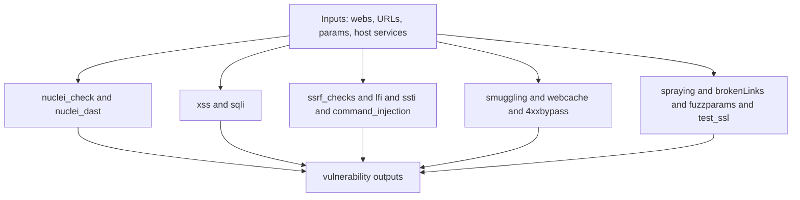

# Vulnerability Scanning Module

The vulnerability module performs active security testing to identify exploitable weaknesses. This module requires explicit authorization as it performs intrusive testing.

---

## ⚠️ Important Warning

> **LEGAL NOTICE:** This module performs active security testing that may:
> - Send malicious payloads to targets
> - Attempt to exploit vulnerabilities
> - Trigger security alerts
> - Potentially cause service disruption
>
> **Only use with explicit written authorization.**

---

## Why This Order of Tests?

Vulnerability checks run last in reconFTW's pipeline for important reasons:

1. **Dependency Chain**: Tests require data from previous phases:
   - URLs from web analysis → XSS, SQLi, LFI testing
   - Parameters from param_discovery → Injection point testing
   - JavaScript analysis → Endpoint/secret candidates and richer URL sets

2. **Detection Risk**: Vuln scanning generates suspicious traffic:
   - SQL injection payloads like `' OR 1=1--`
   - XSS payloads with `<script>` tags
   - SSRF callbacks to external servers
   
   Running this phase last means all passive/semi-active recon is complete before potential detection.

3. **Resource Intensity**: Fuzzing and exploitation testing consume significant resources. Running them on a refined target list (after filtering) is more efficient than testing everything.

---

## Callback Servers for Blind Vulnerabilities

Some vulnerabilities don't show direct responses. Blind SSRF, out-of-band XXE, and blind command injection require callback detection.

reconFTW supports:
- **interactsh**: ProjectDiscovery's callback server (default)
- **Burp Collaborator**: If configured

Configure in `reconftw.cfg`:
```bash
INTERACTSH_URL="https://interact.sh"
INTERACTSH_TOKEN=""  # Optional, for private server
```

---

## Module Overview

| Function | Vulnerability Type | Tools |
|----------|-------------------|-------|
| `nuclei_check` | CVEs, misconfigs, exposures | nuclei |
| `nuclei_dast` | DAST template pass over URLs and candidates | nuclei |
| `xss` | Cross-Site Scripting | dalfox |
| `sqli` | SQL Injection | sqlmap, ghauri |
| `ssrf_checks` | Server-Side Request Forgery | ffuf, interactsh |
| `crlf_checks` | CRLF Injection | crlfuzz |
| `lfi` | Local File Inclusion | ffuf |
| `ssti` | Server-Side Template Injection | TInjA (default), ffuf (legacy engine) |
| `command_injection` | Command Injection | commix |
| `smuggling` | HTTP Request Smuggling | smugglex |
| `webcache` | Web Cache Poisoning | Web-Cache-Vulnerability-Scanner, toxicache |
| `4xxbypass` | 403/401 Bypass | nomore403 |
| `fuzzparams` | Parameter Fuzzing | nuclei |
| `test_ssl` | SSL/TLS Issues | testssl |
| `spraying` | Password Spraying | brutespray, brutus |
| `brokenLinks` | Broken Link Hijacking | second-order, katana (legacy) |

## Module Flow



---

## Configuration Options

```bash
# In reconftw.cfg

# Master toggle (MUST be true for vuln scanning)
VULNS_GENERAL=false

# Individual toggles
XSS=true
TEST_SSL=true
SSRF_CHECKS=true
CRLF_CHECKS=true
LFI=true
SSTI=true
SSTI_ENGINE="TInjA"  # TInjA
TInjA_RATELIMIT=0
TInjA_TIMEOUT=15
SQLI=true
SQLMAP=true
GHAURI=false
BROKENLINKS=true
BROKENLINKS_ENGINE="second-order"  # second-order|legacy
SECOND_ORDER_CONFIG="${tools}/second-order/config/takeover.json"
SECOND_ORDER_DEPTH=1
SECOND_ORDER_THREADS=10
SECOND_ORDER_INSECURE=false
SPRAY=true
COMM_INJ=true
SMUGGLING=true
WEBCACHE=true
WEBCACHE_TOXICACHE=true
TOXICACHE_THREADS=70
TOXICACHE_USER_AGENT="Mozilla/5.0 (X11; Linux x86_64; rv:128.0) Gecko/20100101 Firefox/128.0"
BYPASSER4XX=true
FUZZPARAMS=true

# Nuclei settings
NUCLEICHECK=true
NUCLEI_TEMPLATES_PATH="$HOME/nuclei-templates"
NUCLEI_SEVERITY="info,low,medium,high,critical"
NUCLEI_FLAGS="-silent -retries 2"
NUCLEI_RATELIMIT=150

# Dedicated DAST pass (optional)
NUCLEI_DAST=true
NUCLEI_DAST_TEMPLATE_PATH="${NUCLEI_TEMPLATES_PATH}/dast"
NUCLEI_DAST_EXTRA_ARGS=""

# Callback servers (for blind vulnerabilities)
XSS_SERVER="your_xss_hunter_url"
COLLAB_SERVER="your_interactsh_url"
```

---

## Nuclei Scanning

### `nuclei_check` - Full Vulnerability Scanning

Nuclei is the primary vulnerability scanner, checking for thousands of known vulnerabilities.

**Template Categories:**
- CVEs (known vulnerabilities)
- Exposures (sensitive files, directories)
- Misconfigurations
- Default credentials
- Takeovers
- Technologies

**How It Works:**

```
webs/webs_all.txt → nuclei (templates) → Scan each URL →
→ Match vulnerability patterns → Report findings
```

**Output:**
```
nuclei_output/
├── info_json.txt / info.txt
├── low_json.txt / low.txt
├── medium_json.txt / medium.txt
├── high_json.txt / high.txt
└── critical_json.txt / critical.txt
```

**Sample Output:**
```json
{
  "template-id": "CVE-2021-44228",
  "name": "Apache Log4j RCE",
  "severity": "critical",
  "matched-at": "https://api.example.com/search",
  "extracted-results": ["jndi:ldap://..."]
}
```

**Configuration:**
```bash
NUCLEICHECK=true
NUCLEI_TEMPLATES_PATH="$HOME/nuclei-templates"
NUCLEI_SEVERITY="info,low,medium,high,critical"
NUCLEI_EXTRA_ARGS=""  # e.g., "-etags ssl" to exclude
NUCLEI_FLAGS="-silent -retries 2"
NUCLEI_RATELIMIT=150
```

**Excluding Templates:**
```bash
# Exclude noisy templates
NUCLEI_EXTRA_ARGS="-etags openssh,ssl -eid CVE-2021-12345"
```

---

## Injection Vulnerabilities

### `xss` - Cross-Site Scripting

Tests for XSS vulnerabilities using Dalfox.

**How It Works:**

```
URLs with parameters (gf/xss.txt) → dalfox →
→ Test XSS payloads → Verify execution → Report
```

**XSS Types Tested:**
- Reflected XSS
- DOM-based XSS
- Blind XSS (with callback server)

**Output:**
```
vulns/xss.txt
```

**Sample Output:**
```
[POC] https://example.com/search?q="><script>alert(1)</script>
  Type: Reflected
  Parameter: q
  Payload: "><script>alert(1)</script>
```

**Configuration:**
```bash
XSS=true
XSS_SERVER="https://your.xss.hunter"  # For blind XSS
DALFOX_THREADS=200
```

---

### `sqli` - SQL Injection

Tests for SQL injection using SQLMap and optionally Ghauri.

**How It Works:**

```
URLs with parameters → sqlmap/ghauri →
→ Test injection points → Identify vulnerable params → Report
```

**SQLi Types:**
- Error-based
- Union-based
- Blind (Boolean/Time-based)
- Stacked queries

**Output:**
```
vulns/sqli.txt
vulns/sqlmap_output/  # Detailed SQLMap results
```

**Sample Output:**
```
[VULNERABLE] https://example.com/user?id=1
  Parameter: id
  Type: Boolean-based blind
  Backend: MySQL
```

**Configuration:**
```bash
SQLI=true
SQLMAP=true
GHAURI=false  # Alternative SQLi tool
```

---

### `ssti` - Server-Side Template Injection

Tests for template injection vulnerabilities.

**How It Works:**

```
URLs with parameters → ffuf (SSTI payloads) →
→ Check for template execution → Report
```

**Payloads Tested:**
```
{{7*7}}
${7*7}
<%= 7*7 %>
{7*7}
${{7*7}}
```

**Output:**
```
vulns/ssti.txt
```

**Configuration:**
```bash
SSTI=true
SSTI_ENGINE="TInjA"
TInjA_RATELIMIT=0
TInjA_TIMEOUT=15
ssti_wordlist=${WORDLISTS_DIR}/ssti_wordlist.txt
```

---

### `lfi` - Local File Inclusion

Tests for LFI/path traversal vulnerabilities.

**How It Works:**

```
URLs with parameters → ffuf (LFI payloads) →
→ Check for file content → Report
```

**Payloads Tested:**
```
../../../etc/passwd
..%2f..%2f..%2fetc/passwd
....//....//....//etc/passwd
/etc/passwd
```

**Output:**
```
vulns/lfi.txt
```

**Configuration:**
```bash
LFI=true
lfi_wordlist=${WORDLISTS_DIR}/lfi_wordlist.txt
```

---

### `command_injection` - Command Injection

Tests for OS command injection using Commix.

**How It Works:**

```
URLs with parameters → commix →
→ Test command separators → Verify execution → Report
```

**Injection Techniques:**
- Classic injection (`;`, `|`, `&`)
- Blind injection (time-based)
- File-based injection

**Output:**
```
vulns/command_injection.txt
```

**Configuration:**
```bash
COMM_INJ=true
```

---

## Server-Side Vulnerabilities

### `ssrf_checks` - Server-Side Request Forgery

Tests for SSRF vulnerabilities using callback servers.

**How It Works:**

```
URLs with parameters → Replace values with callback URL →
→ Monitor for callbacks → Report SSRF
```

**Requires:** Collaborator server (interactsh, Burp Collaborator)

**SSRF Payloads:**
```
http://callback.server/
http://169.254.169.254/  # AWS metadata
http://127.0.0.1/
```

**Alternate Protocol Payloads (Optional):**
- Loaded from `config/ssrf_payloads.txt` (e.g., `gopher://`, `dict://`, `file://`, metadata endpoints).
- Results (body-match based) are written to `vulns/ssrf_alt_protocols.txt`.

**Output:**
```
vulns/ssrf_requested.txt
vulns/ssrf_requested_headers.txt
vulns/ssrf_callback.txt
vulns/ssrf_alt_protocols.txt
```

**Configuration:**
```bash
SSRF_CHECKS=true
COLLAB_SERVER="https://your.interact.sh"
```

---

### `nuclei_dast` - Nuclei DAST Pass

Runs `nuclei -dast` templates over URL inputs gathered across reconFTW (web targets, extracted URLs, and GF candidates). This is intended to provide a template-based replacement for several single-purpose scanners that overlap with Nuclei coverage.

This module is executed as part of the vulnerability pipeline (`-a` / `VULNS_GENERAL=true`). When vuln scanning is enabled, reconFTW force-enables `nuclei_dast` to avoid accidentally losing coverage due to a separate toggle.

**Inputs:**
- `webs/webs_all.txt` (baseline web targets)
- `webs/url_extract_nodupes.txt` (extracted URLs)
- `gf/*.txt` (pattern-based candidates)

**Output:**
```
nuclei_output/dast_json.txt
vulns/nuclei_dast.txt
```

Each JSON line is annotated with `scan_scope:"dast"` for traceability.

**Safety Gate:**
- When `DEEP=false`, reconFTW may skip the DAST pass if the target URL count exceeds `DEEP_LIMIT2`.

**Configuration:**
```bash
NUCLEI_DAST=true
NUCLEI_DAST_TEMPLATE_PATH="${NUCLEI_TEMPLATES_PATH}/dast"
NUCLEI_DAST_EXTRA_ARGS=""
```

---

### `crlf_checks` - CRLF Injection

Tests for HTTP header injection via CRLF.

**How It Works:**

```
URLs → crlfuzz → Inject CRLF sequences →
→ Check for header injection → Report
```

**Output:**
```
vulns/crlf.txt
```

**Configuration:**
```bash
CRLF_CHECKS=true
```

---

## Advanced Vulnerabilities

### Prototype Pollution (Template-Based)

Dedicated `ppmap` prototype pollution checks were removed. Prefer Nuclei templates (via `nuclei_check` and/or `nuclei_dast`) for prototype pollution coverage.

---

### `smuggling` - HTTP Request Smuggling

Tests for HTTP request smuggling vulnerabilities.

**Techniques Tested:**
- CL.TE (Content-Length vs Transfer-Encoding)
- TE.CL
- TE.TE

**Output:**
```
vulns/smuggling.txt
```

**Configuration:**
```bash
SMUGGLING=true
```

---

### `webcache` - Web Cache Poisoning

Tests for web cache poisoning vulnerabilities.

**Issues Detected:**
- Cache key manipulation
- Unkeyed header poisoning
- Parameter cloaking

**Output:**
```
vulns/webcache.txt
vulns/webcache_toxicache.txt
```

**Configuration:**
```bash
WEBCACHE=true
WEBCACHE_TOXICACHE=true
TOXICACHE_THREADS=70
TOXICACHE_USER_AGENT="Mozilla/5.0 (...)"
```

---

## Bypass Techniques

### Open Redirects (Template-Based)

Dedicated `Oralyzer` open redirect checks were removed. Prefer Nuclei templates for open redirect coverage.

---

### `4xxbypass` - 403/401 Bypass

Attempts to bypass access controls returning 403/401 responses.

**Techniques:**
- Header manipulation (X-Forwarded-For, etc.)
- Path manipulation
- HTTP method changes
- Protocol downgrades

**How It Works:**

```
403/401 URLs → nomore403 → Try bypass techniques →
→ Check for successful access → Report
```

**Output:**
```
vulns/4xxbypass.txt
```

**Sample Output:**
```
[BYPASS] https://example.com/admin
  Original: 403 Forbidden
  Technique: X-Original-URL header
  Result: 200 OK
```

**Configuration:**
```bash
BYPASSER4XX=true
```

---

## SSL/TLS Analysis

### `test_ssl` - SSL/TLS Security

Full SSL/TLS security analysis.

**Issues Detected:**
- Expired certificates
- Weak ciphers
- Protocol vulnerabilities (POODLE, BEAST, etc.)
- Certificate chain issues
- HSTS misconfigurations

**Output:**
```
vulns/testssl.txt
```

**Configuration:**
```bash
TEST_SSL=true
```

---

## Credential Testing

### `spraying` - Password Spraying

Attempts common passwords against discovered services.

**Services Tested:**
- SSH
- FTP
- HTTP Basic Auth
- Database ports
- And more...

**How It Works:**

`SPRAY_ENGINE=brutespray`:
```
hosts/portscan_active.gnmap → brutespray → credential attempts
```

`SPRAY_ENGINE=brutus`:
```
hosts/fingerprintx.jsonl (or naabu_open→fingerprintx fallback) → brutus → successful credentials JSONL
```

**Output:**
```
vulns/brutespray/         # When using brutespray engine
vulns/brutus.jsonl        # When using brutus engine
```

**Configuration:**
```bash
SPRAY=true
SPRAY_ENGINE="brutespray"   # brutespray|brutus
SPRAY_BRUTUS_ONLY_DEEP=true
BRUTUS_USERNAMES=""
BRUTUS_PASSWORDS=""
BRUTUS_KEY_FILE=""
BRUTESPRAY_THREADS=20
BRUTESPRAY_CONCURRENCE=10
```

> ⚠️ **Warning:** Password spraying can lock out accounts. Use with caution.

---

## Parameter Fuzzing

### `fuzzparams` - Parameter Value Fuzzing

Fuzzes parameter values with nuclei templates.

**How It Works:**

```
URLs with parameters → nuclei (fuzzing templates) →
→ Test injection points → Report findings
```

**Output:**
```
vulns/fuzzparams.txt
```

**Configuration:**
```bash
FUZZPARAMS=true
```

---

## Broken Links

### `brokenLinks` - Broken Link Hijacking

Identifies broken links that could be hijacked.

**How It Works:**

```
webs.txt → second-order (default) using takeover config →
→ Parse non-200 URL attributes → Report
```

Legacy mode:
```
webs.txt → katana (crawl) → httpx status checks →
→ Extract 4xx URLs → Report
```

**Output:**
```
vulns/brokenLinks.txt
```

**Configuration:**
```bash
BROKENLINKS=true
BROKENLINKS_ENGINE="second-order"  # second-order|legacy
SECOND_ORDER_CONFIG="${tools}/second-order/config/takeover.json"
SECOND_ORDER_DEPTH=1
SECOND_ORDER_THREADS=10
SECOND_ORDER_INSECURE=false
```

---

## Enabling Vulnerability Scanning

Vulnerability scanning is **disabled by default**. To enable:

### Method 1: Use `-a` Flag

```bash
# Full recon + all vulnerability checks
./reconftw.sh -d example.com -a
```

### Method 2: Enable in Config

```bash
# In reconftw.cfg
VULNS_GENERAL=true
```

### Method 3: Selective Enabling

```bash
# Enable only specific checks
VULNS_GENERAL=true
XSS=true
SQLI=true
SSRF_CHECKS=false
# ... etc
```

---

## Output Summary

| File | Content |
|------|---------|
| `nuclei_output/*.txt` | Nuclei findings by severity |
| `nuclei_output/dast_json.txt` | Nuclei DAST JSON findings |
| `vulns/xss.txt` | XSS vulnerabilities |
| `vulns/sqli.txt` | SQL injection |
| `vulns/nuclei_dast.txt` | Nuclei DAST human-readable findings |
| `vulns/ssrf_requested.txt` | SSRF requested URLs (callback payloads) |
| `vulns/ssrf_requested_headers.txt` | SSRF requested headers (callback payloads) |
| `vulns/ssrf_callback.txt` | SSRF callbacks received (OOB) |
| `vulns/ssrf_alt_protocols.txt` | SSRF alternate protocol findings (content-match based) |
| `vulns/lfi.txt` | LFI/path traversal |
| `vulns/ssti.txt` | Template injection |
| `vulns/ssti_tinja.txt` | Template injection (TInjA-normalized findings) |
| `vulns/4xxbypass.txt` | Access control bypasses |
| `vulns/testssl.txt` | SSL/TLS issues |
| `vulns/webcache_toxicache.txt` | toxicache web cache findings |
| `vulns/brokenLinks.txt` | Broken links/takeover candidates |

---

## Best Practices

1. **Authorization First:** Always have written permission before scanning

2. **Rate Limiting:** Use `-q` flag to avoid overwhelming targets

3. **Scope Awareness:** Use `-x` to exclude out-of-scope targets

4. **Verification:** Manually verify findings before reporting

5. **Responsible Disclosure:** Follow responsible disclosure practices

6. **Callback Servers:** Set up proper callback infrastructure for blind vulns

---

## Next Steps

- **[Host Module](hosts.md)** - Port scanning and host analysis
- **[Output Interpretation](../07-output/output.md)** - Understand results
