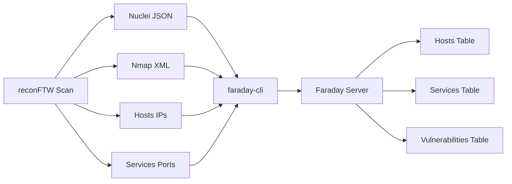

# Faraday Integration

Faraday is a collaborative vulnerability management platform. reconFTW integrates with Faraday to automatically import scan results.

---

## What is Faraday?

Faraday provides:

- **Centralized vulnerability database**
- **Team collaboration features**
- **Report generation**
- **Integration with 80+ security tools**
- **Workspace management**

---

## Prerequisites

### Faraday Installation

```bash
# Docker installation (recommended)
docker pull faradaysec/faraday:latest
docker run -d --name faraday -p 5985:5985 faradaysec/faraday

# Or native installation
uv tool install faradaysec
```

### Faraday Setup

1. Access Faraday web interface: `http://localhost:5985`
2. Create admin account
3. Create workspace for your project
4. Authenticate your CLI session (`faraday-cli`) against your Faraday instance

---

## Configuration in reconFTW

### Enable Faraday Integration

```bash
# In reconftw.cfg

# Enable Faraday
FARADAY=true

# Workspace name
FARADAY_WORKSPACE="reconftw"
```

---

## Data Imported to Faraday

reconFTW automatically sends:

| Data Type | Source | Faraday Entity |
|-----------|--------|----------------|
| Hosts | Subdomain resolution | Host |
| Services | Port scan (nmap) | Service |
| Vulnerabilities | Nuclei results | Vulnerability |
| CVEs (Optional) | Nmap vulners script (deep portscan profile) | Vulnerability |

---

## Integration Flow



---

## Workspace Management

### Create Workspace

```bash
# Via Faraday CLI
faraday-cli create_ws reconftw
```

### Workspace Strategy

| Strategy | Description | Use Case |
|----------|-------------|----------|
| Per-target | One workspace per domain | Isolated scans |
| Per-program | One workspace per bug bounty | Program tracking |
| Unified | Single workspace | Overview of all targets |

---

## Viewing Results

### Faraday Web Interface

1. Open `http://localhost:5985`
2. Select workspace (`reconftw`)
3. Navigate to:
   - **Hosts:** All discovered hosts with IPs
   - **Services:** Ports and services per host
   - **Vulns:** All vulnerabilities by severity

### Faraday CLI

```bash
# List hosts
faraday-cli host -w reconftw

# List vulnerabilities
faraday-cli vuln -w reconftw

# Export report
faraday-cli report -w reconftw -o report.pdf
```

---

## Report Generation

### Built-in Reports

Faraday generates reports in multiple formats:

- PDF
- HTML
- Markdown
- CSV

### Custom Templates

```bash
# Create custom report template
faraday-cli report -w reconftw --template custom.html
```

---

## Advanced Configuration

### Severity Mapping

reconFTW maps nuclei severities to Faraday:

| Nuclei Severity | Faraday Severity |
|-----------------|------------------|
| critical | Critical |
| high | High |
| medium | Medium |
| low | Low |
| info | Informational |

### Custom Fields

```bash
# Add custom data to vulnerabilities
# In reconftw.cfg
FARADAY_CUSTOM_FIELDS=true
```

### Bulk Import

For large scans, results are batched:

```bash
# Batch size configuration
FARADAY_BATCH_SIZE=100
```

---

## Troubleshooting

### Connection Issues

```bash
# Test Faraday CLI session/context
faraday-cli status
```

### Authentication Errors

```bash
# Re-authenticate faraday-cli for your target server/context
faraday-cli status
```

### Missing Data

1. Check workspace exists
2. Verify scan completed successfully
3. Review Faraday logs: `docker logs faraday`

### Duplicate Entries

Faraday deduplicates by:
- Host: IP address
- Service: IP + port + protocol
- Vulnerability: Name + host + service

---

## Best Practices

1. **Workspace naming:** Use consistent naming convention
2. **CLI auth context:** Ensure `faraday-cli` is authenticated before running reconFTW
3. **Regular cleanup:** Archive old workspaces
4. **Backup:** Export workspaces regularly
5. **Access control:** Use Faraday roles for team access

---

## Alternative: Manual Import

If automatic integration fails, import manually:

```bash
# Import nmap results
faraday-cli tool nmap -w reconftw hosts/portscan_active.xml

# Import nuclei results
faraday-cli tool nuclei -w reconftw nuclei_output/*_json.txt
```

---

## Next Steps

- **[Deployment Guide](../09-deployment/deployment.md)** - Full setup
- **[Output Interpretation](../07-output/output.md)** - Understanding results
