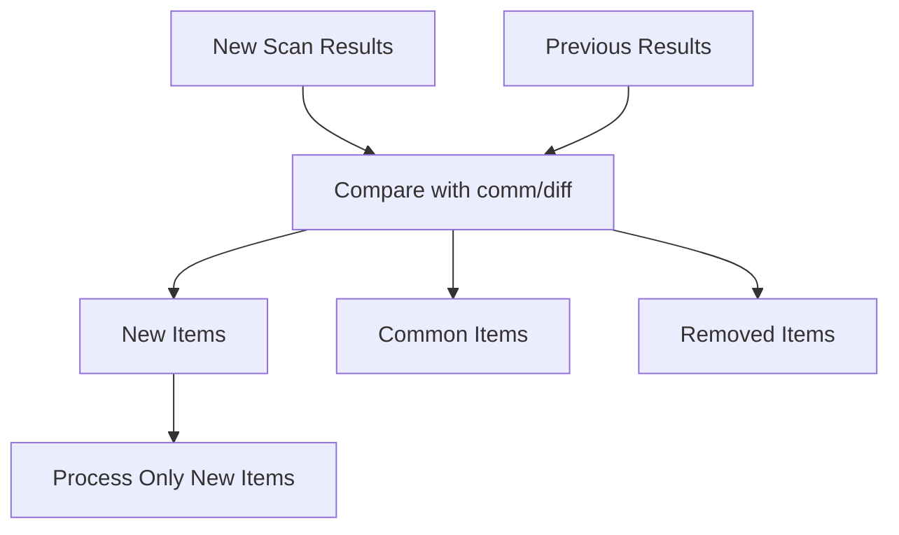

# Advanced Usage

This guide covers advanced features, customization, and optimization techniques for power users.

---

## Custom Function Execution

### Running Specific Functions

Use the `-c` flag to run specific functions:

```bash
# Run single function
./reconftw.sh -d example.com -c nuclei_check

# Run multiple functions
./reconftw.sh -d example.com -c sub_passive
./reconftw.sh -d example.com -c webprobe_simple
./reconftw.sh -d example.com -c nuclei_check
```

### Available Functions

| Module | Functions |
|--------|-----------|
| OSINT | `google_dorks`, `github_dorks`, `metadata`, `emails`, `domain_info` |
| Subdomains | `sub_passive`, `sub_crt`, `sub_brute`, `sub_permut`, `sub_dns` |
| Web | `webprobe_simple`, `screenshot`, `fuzz`, `urlchecks`, `jschecks` |
| Vulns | `nuclei_check`, `xss`, `sqli`, `ssrf_checks`, `fuzzparams` |
| Hosts | `portscan`, `cdnprovider`, `waf_checks`, `geo_info` |

### Function Dependencies

Some functions depend on others:

```
webprobe_simple → screenshot → urlchecks → jschecks
sub_passive → sub_dns → webprobe_simple
```

---

## Creating Custom Modules

### Module Structure

```bash
# Create custom module: modules/custom.sh
#!/bin/bash

custom_function() {
    start_func "${FUNCNAME[0]}" "Running custom check"
    
    # Your code here
    echo "Custom scan for $domain"
    
    # Use existing outputs
    if [[ -f "$dir/webs/webs.txt" ]]; then
        cat "$dir/webs/webs.txt" | custom-tool > "$dir/custom/results.txt"
    fi
    
    end_func "Results: $dir/custom/results.txt"
}
```

### Loading Custom Modules

Add to reconftw.sh:

```bash
# Load custom module
source "$SCRIPTPATH/modules/custom.sh"
```

### Function Templates

```bash
# Template with all features
my_function() {
    # Function lifecycle
    start_func "${FUNCNAME[0]}" "Description"
    
    # Check if should run in DEEP mode
    if should_run_deep "$input_file" "$DEEP_LIMIT"; then
        # DEEP mode behavior
    fi
    
    # Use axiom if enabled
    if [[ "$AXIOM" == true ]]; then
        axiom_scan "$input_file" "my-tool" "$output_file"
    else
        my-tool < "$input_file" > "$output_file"
    fi
    
    # Notifications
    notification "Found $(wc -l < $output_file) results"
    
    # End function
    end_func "Completed: $(wc -l < $output_file) results"
}
```

---

## Plugin System

### Plugin Architecture

reconFTW supports plugins via hooks:

```bash
# In reconftw.cfg
PLUGINS=true
PLUGINS_PATH="$SCRIPTPATH/plugins"
```

### Creating Plugins

```bash
# plugins/my-plugin.sh
#!/bin/bash

# Hook: after_subdomains
plugin_after_subdomains() {
    echo "[PLUGIN] Processing subdomains..."
    # Custom post-processing
}

# Hook: after_scan
plugin_after_scan() {
    echo "[PLUGIN] Scan completed, generating custom report..."
    # Custom reporting
}

# Register plugin
plugins_register "my-plugin" "after_subdomains,after_scan"
```

### Available Hooks

| Hook | Timing |
|------|--------|
| `before_scan` | Before scan starts |
| `after_subdomains` | After subdomain enumeration |
| `after_webprobe` | After web probing |
| `after_vulns` | After vulnerability scanning |
| `after_scan` | After scan completes |

---

## Wordlist Customization

### Custom Wordlist Configuration

```bash
# In reconftw.cfg

# Wordlists are shipped under ${WORDLISTS_DIR} by default.
# You can override any wordlist to point to your own file (any path).

# Custom subdomain wordlists
subs_wordlist="/path/to/custom_subdomains.txt"
subs_wordlist_big="/path/to/custom_subdomains_big.txt"

# Custom directory wordlists
fuzz_wordlist="/path/to/custom_dirs.txt"

# Optional vuln-specific wordlists
lfi_wordlist="/path/to/custom_lfi.txt"
ssti_wordlist="/path/to/custom_ssti.txt"
```

### Generating Custom Wordlists

```bash
# Generate target-specific wordlist
./reconftw.sh -d example.com -c wordlist_gen

# Merge wordlists
cat wordlist1.txt wordlist2.txt | sort -u > merged.txt

# Filter by length
awk 'length($0) >= 3 && length($0) <= 20' wordlist.txt > filtered.txt
```

### Per-Target Wordlists

```bash
# Create a target-specific config and pass it with -f
cat > config/example.com.cfg <<'EOF'
subs_wordlist="/path/to/example.com_subdomains.txt"
fuzz_wordlist="/path/to/example.com_fuzzing.txt"
EOF

./reconftw.sh -d example.com -r -f config/example.com.cfg
```

---

## Resolver Optimization

### Resolver Setup

```bash
# Validate resolvers
dnsvalidator -tL public_resolvers.txt -threads 100 -o /path/to/resolvers.txt

# Use validated resolvers
resolvers="/path/to/resolvers.txt"
```

### Trusted Resolvers

```bash
# Trusted resolvers (for sensitive queries)
resolvers_trusted="/path/to/resolvers_trusted.txt"

# Contents: reliable, trusted DNS servers
8.8.8.8
8.8.4.4
1.1.1.1
9.9.9.9
```

---

## Incremental Mode Deep Dive

### How Incremental Works

1. First scan: Full enumeration, results saved
2. Subsequent scans: Compare new vs existing
3. Process only NEW findings
4. Merge results

```bash
# Enable incremental
./reconftw.sh -d example.com -r --incremental
```

### Incremental Data Flow



### Incremental Configuration

```bash
# In reconftw.cfg
INCREMENTAL_MODE=false     # Enable with --incremental
QUICK_RESCAN=false         # Skip heavy stages when nothing new
MONITOR_MODE=false         # Enable with --monitor
MONITOR_INTERVAL_MIN=60
MONITOR_MAX_CYCLES=0       # 0 = infinite
MONITOR_MIN_SEVERITY=high  # critical|high|medium|low|info
ALERT_SUPPRESSION=true
ALERT_SEEN_FILE=".incremental/alerts_seen.hashes"
```

---

## Continuous Monitoring and Reporting

### Monitor Workflows

```bash
# Continuous recon every 30 minutes (48 cycles)
./reconftw.sh -d example.com -r --monitor --monitor-interval 30 --monitor-cycles 48

# Continuous web mode from URL list
./reconftw.sh -d example.com -l urls.txt -w --monitor --monitor-interval 60
```

### Report Rebuild and Export

```bash
# Rebuild report artifacts without rescanning
./reconftw.sh -d example.com --report-only --export all
```

Generated artifacts are stored under `Recon/<target>/report/`:
- `report.json`, `index.html`
- `latest/report.json`, `latest/index.html`
- `findings_normalized.jsonl`, `export_all.jsonl`
- `subdomains.csv`, `webs.csv`, `hosts.csv`, `findings.csv`

---

## Checkpoint/Recovery System

### How Checkpoints Work

```bash
# Checkpoint directory
Recon/example.com/.called_fn/

# Each completed function creates a marker
.called_fn/
├── .sub_passive
├── .sub_crt
├── .webprobe_simple
└── .nuclei_check
```

### Resuming Interrupted Scans

```bash
# Scan interrupted at nuclei_check
./reconftw.sh -d example.com -a

# Resume - skips completed functions
./reconftw.sh -d example.com -a
# Output includes normalized cache/skip statuses (for example: CACHE sub_passive 0s)
```

### Reset Checkpoints

```bash
# Reset all checkpoints (full rescan)
rm -rf Recon/example.com/.called_fn/

# Reset specific function
rm Recon/example.com/.called_fn/.nuclei_check
```

### Checkpoint Configuration

```bash
# Checkpoint and diff controls
DIFF=false
INCREMENTAL_MODE=false
```

---

## Rate Limiting Strategies

### Per-Tool Rate Limits

```bash
# In reconftw.cfg

# httpx rate limit (requests per second)
HTTPX_RATELIMIT=150

# Nuclei rate limit
NUCLEI_RATELIMIT=150

# FFUF rate limit
FFUF_RATELIMIT=0  # 0 = no limit
```

### Adaptive Rate Limiting

```bash
# Enable adaptive rate limiting
./reconftw.sh -d example.com -a --adaptive-rate

# Automatically adjusts based on:
# - Response times
# - Error rates
# - 429 responses
```

### Global Rate Limit

```bash
# Limit all requests
./reconftw.sh -d example.com -r -q 100  # 100 req/sec global
```

### Target-Specific Limits

```bash
# Create scope file with rate limits
echo "example.com:50" > scope.txt  # 50 req/sec for this target

./reconftw.sh -d example.com -r -i scope.txt
```

---

## Multi-Target Scanning

### Target List

```bash
# targets.txt
example.com
test.com
target.org
```

```bash
# Scan multiple targets
./reconftw.sh -l targets.txt -r
```

### Parallel Execution

```bash
# Run multiple scans in parallel
cat targets.txt | parallel -j 3 "./reconftw.sh -d {} -r"
```

### Multi-Target with Different Configs

```bash
# Create per-target configs
cp reconftw.cfg configs/example.com.cfg
cp reconftw.cfg configs/target.org.cfg

# Run with specific config
./reconftw.sh -d example.com -r -f configs/example.com.cfg
```

---

## Scope File Management

### Scope File Format

```bash
# inscope.txt - domains to include
example.com
*.example.com
api.example.org

# outofscope.txt - domains to exclude
blog.example.com
legacy.example.com
```

### Using Scope Files

```bash
# Include scope
./reconftw.sh -d example.com -r -i inscope.txt

# Exclude scope
./reconftw.sh -d example.com -r -x outofscope.txt

# Both
./reconftw.sh -d example.com -r -i inscope.txt -x outofscope.txt
```

### Wildcard Scopes

```bash
# inscope.txt with wildcards
*.example.com        # All subdomains
*.*.example.com      # Second-level subdomains
api.*.example.com    # api.X.example.com pattern
```

---

## Notification Customization

### Notification Providers

```bash
# In reconftw.cfg
NOTIFICATION=true

# Configure in ~/.config/notify/provider-config.yaml
```

### Provider Configuration

```yaml
# ~/.config/notify/provider-config.yaml
slack:
  - id: "slack-webhook"
    slack_webhook_url: "https://hooks.slack.com/services/XXX"

discord:
  - id: "discord-webhook"
    discord_webhook_url: "https://discord.com/api/webhooks/XXX"

telegram:
  - id: "telegram"
    telegram_api_key: "XXX"
    telegram_chat_id: "XXX"
```

### Custom Notification Templates

```bash
# Custom notification format
notification() {
    local message="$1"
    echo "[$(date)] $domain: $message" | notify -silent
}
```

---

## AI Report Customization

### AI Configuration

```bash
# In reconftw.cfg
AI_MODEL="llama3:8b"
AI_REPORT_TYPE="md"        # md, txt
AI_REPORT_PROFILE="bughunter"  # executive, brief, bughunter
AI_PROMPTS_FILE=""         # Optional custom prompts file
AI_MAX_CHARS_PER_FILE=50000
AI_MAX_FILES_PER_CATEGORY=200
AI_REDACT=true
AI_ALLOW_MODEL_PULL=false
AI_STRICT=false
```

### Custom Report Prompts

```bash
# Use a custom prompts JSON file (same schema as reconftw_ai/prompts.json)
AI_PROMPTS_FILE="/path/to/custom_prompts.json"
```

### Report Types

| Type | Focus | Audience |
|------|-------|----------|
| `executive` | High-level non-technical summary | Management |
| `brief` | Concise prioritized findings | Security team |
| `bughunter` | Technical offensive-style analysis | Pentesters / bug bounty |

---

## Performance Tuning

### Thread Optimization

```bash
# In reconftw.cfg

# Based on CPU cores (nproc)
THREADS=$(($(nproc) * 2))

# Per-tool threads
HTTPX_THREADS=50
FFUF_THREADS=40
KATANA_THREADS=20
DALFOX_THREADS=200
RESOLVE_DOMAINS_THREADS=150
TLSX_THREADS=1000
```

### Memory Management

```bash
# Limit memory-intensive tools
FFUF_THREADS=20  # Reduce if OOM
HTTPX_THREADS=20
KATANA_THREADS=10

# Use streaming where possible
# Avoid loading large files into memory
```

### Disk I/O Optimization

```bash
# Use SSD for output directory
OUTPUT="/mnt/ssd/Recon"

# Compress old results
tar -czf old_results.tar.gz Recon/old_target/
```

### Network Optimization

```bash
# Reduce HTTP timeouts
HTTPX_TIMEOUT=5
HTTPX_UNCOMMONPORTS_TIMEOUT=5

# Reduce passive enum time window
SUBFINDER_ENUM_TIMEOUT=120
```

---

## Circuit Breaker Pattern

### Configuration

```bash
# In reconftw.cfg
CIRCUIT_BREAKER=true
CIRCUIT_BREAKER_THRESHOLD=50    # Error threshold
CIRCUIT_BREAKER_TIMEOUT=300     # Cooldown in seconds
```

### Behavior

1. **Closed:** Normal operation
2. **Open:** Too many errors, stop requests
3. **Half-Open:** Test with few requests
4. **Recovery:** Resume normal operation

---

## Environment Variables

### Override Configuration

```bash
# Set via environment
export RECONFTW_THREADS=100
export RECONFTW_OUTPUT="/custom/output"

./reconftw.sh -d example.com -r
```

### Precedence

1. Command-line flags (highest)
2. Environment variables
3. Custom config file (-f)
4. Default reconftw.cfg (lowest)

---

## Debugging

### Dry Run Mode

```bash
# Preview commands without executing
./reconftw.sh -d example.com -r --dry-run
```

### Verbose Output

```bash
# Enable debug logging
DEBUG=true ./reconftw.sh -d example.com -r

# Or in config
DEBUG=true
```

### Log Analysis

```bash
# Check execution log
tail -f "$(ls -1t Recon/example.com/.log/*.txt | head -n1)"

# Check errors
grep -i error Recon/example.com/.log/*.txt
```

---

## Next Steps

- **[Troubleshooting](../11-troubleshooting/troubleshooting.md)** - Common issues
- **[Configuration](../04-configuration/configuration.md)** - All options
