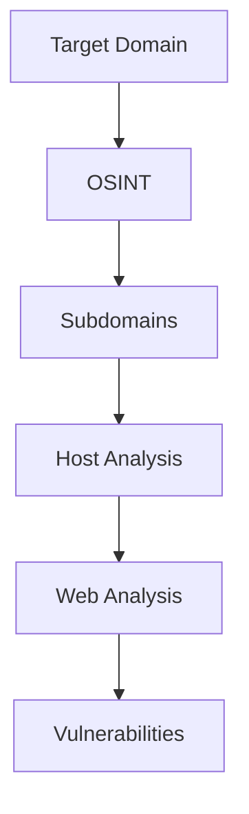

# Assets Directory

This directory contains images and other media files for the reconFTW documentation.

## Directory Structure

```
assets/
├── images/           # Screenshots, diagrams, and illustrations
│   ├── architecture/ # Architecture diagrams
│   ├── screenshots/  # UI screenshots
│   ├── diagrams/     # Flow diagrams
│   └── icons/        # Icons and logos
└── README.md         # This file
```

## Required Images

The following images are referenced in the documentation and need to be created:

### Architecture Diagrams

| Filename | Location | Description |
|----------|----------|-------------|
| `architecture-overview.png` | concepts.md | High-level reconFTW architecture showing modules and data flow |
| `data-flow.png` | concepts.md | Data flow between modules showing how results propagate |
| `checkpoint-system.png` | concepts.md | Visual explanation of checkpoint/resume system |
| `axiom-architecture.png` | axiom.md | Axiom distributed scanning architecture |
| `faraday-integration.png` | faraday.md | Data flow from reconFTW to Faraday |

### Screenshot Examples

| Filename | Location | Description |
|----------|----------|-------------|
| `terminal-scan-output.png` | getting-started.md | Terminal showing reconFTW running a scan |
| `screenshot-gallery.png` | web-analysis.md | Nuclei screenshot gallery example |
| `nuclei-results.png` | vulnerabilities.md | Example Nuclei vulnerability output |
| `faraday-dashboard.png` | faraday.md | Faraday web interface with imported results |

### Module Diagrams

| Filename | Location | Description |
|----------|----------|-------------|
| `osint-flow.png` | osint.md | OSINT module data flow |
| `subdomain-flow.png` | subdomains.md | Subdomain enumeration pipeline |
| `web-analysis-flow.png` | web-analysis.md | Web analysis module flow |
| `vuln-scanning-flow.png` | vulnerabilities.md | Vulnerability scanning workflow |
| `host-analysis-flow.png` | hosts.md | Host analysis pipeline |

## Image Guidelines

### Dimensions

- **Architecture diagrams:** 1200x800px (landscape)
- **Screenshots:** 1400x900px or native resolution
- **Flow diagrams:** 800x1200px (portrait) or 1200x800px (landscape)
- **Icons:** 64x64px or 128x128px

### Format

- **Diagrams:** PNG with transparent background preferred
- **Screenshots:** PNG
- **Icons:** SVG preferred, PNG acceptable

### Style Guidelines

- Use consistent color scheme matching reconFTW branding
- Primary color: `#2D3748` (dark blue-gray)
- Accent color: `#48BB78` (green)
- Use clean, readable fonts (Inter, Roboto, or system fonts)
- Include proper contrast for accessibility

## Creating Images

### Recommended Tools

- **Diagrams:** draw.io, Excalidraw, Mermaid
- **Screenshots:** macOS Screenshot, Flameshot, ShareX
- **Image editing:** GIMP, Figma, Canva

### Using Mermaid (for GitBook)

GitBook supports Mermaid diagrams. Example:



### ASCII Diagrams

The documentation includes ASCII diagrams as fallbacks. These work in all environments and don't require images.

## Placeholder Convention

In the documentation, image placeholders are marked with HTML comments:

```html
<!-- IMAGE PLACEHOLDER
**Image: filename.png**
Description: Detailed description of what the image should show.
- Key element 1
- Key element 2
- Key element 3
-->
```

## Contributing Images

1. Create image following guidelines above
2. Place in appropriate subdirectory
3. Use descriptive filename (kebab-case)
4. Update documentation to reference image:
   ```markdown
   
   ```
5. Submit PR with image and documentation update

## License

All images in this directory should be:
- Original creations, OR
- Properly licensed for open source use (CC0, CC-BY, MIT, etc.)

Do not include copyrighted images without permission.
